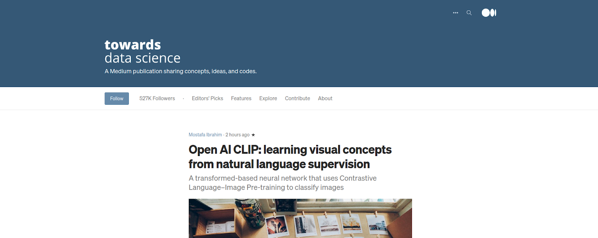

# Medium Article Generator

## Table of Contents

* [General Information](#General-Information)
    * [Exploratory Data Analysis](#Exploratory-Data-Analysis)
    * [GPT-2](#GPT2)
    * [Final Results](#Final-Results)
    * [Tools Used](#Tools-Used)
    * [Future Improvements](#Future-Improvements)

## General Information
Towards Data Science Inc. provides a platform for thousands of people to exchange ideas and to expand their understanding of data science. This projects aims combine use supervised and transfer learning to create a model that is able to detect whether a particular data science article will be successful on Towards Data Science Inc.'s website. This will enable businesses or authors to quickly assess whether their time will be effectively used on the idea they have.
_______________________________________________
## Exploratory Data Analysis:

Approximately 35,000 article titles, dates, and 'claps' (similar to 'likes') were scraped from 'www.towardsdatascience.com' from 01Jan2018-30Dec2020. The total articles printed increased from around 5000 in 2018 to around 20000 in 2020, which is approximately 50 articles a week! First, the Term Frequency-Inverse Document Frequency (TF-IDF) was used to find words that increased and decreased the most from 2018-2020. Next, the article titles were labelled as popular if they were in the top 35% of 'claps' for that year and unpopular if they were in the bottom 35% of 'claps' for that year, in order to properly separate the target data for classificaiton. Finally, the full article texts were scraped on the popular and unpopular data sets in order to give more fidelity to the results. The word clouds below show terms that increased (in green) and decreased (in red) between 2018 and 2020:

  

### The project files are organized as follows:

- EDA.ipynb:
- NLP.ipynb: Project executable code used in AWS SageMaker
- text: Includes the compiled text files used for fine tuning the CPT-2 model
- src: Includes all the functions used in the EDA & NLP files
- data: Includes all the csv files created from the EDA & NLP files

### Articles used for help:

> Scraping Medium with Python & Beautiful Soup: https://medium.com/the-innovation/scraping-medium-with-python-beautiful-soup-3314f898bbf5
____________________________________________________________

## Supervised Learning Models:

***Step 1: Establish Training and Testing Data***

The training and testing data was compiled from articles between 2018 to 2020 and split into a data set containing the top and bottom 35% of articles based on the number of 'claps' they recieved. Examples from the popular and unpopular article titles are seen below:

  

***Step 2: Supervised Model Results: Classification***

A list of classification models were used on the popular/unpopular article titles from the data set including: Decision Tree, Random Forest, KNN, XGBClassifier, Gradient Boosting, and Ada Boost Classifier. The figure below shows how poorly these models did using only the article titles.

  

***Step 3: Supervised Model Results: Regression***

Due to the inaccuracies from the classification results the decision was made to run a list of regression models on article titles from the entire dataset using the number of 'claps' as the target data. The results below do not show much improvement from the baseline average.

  

***Step 4: Transfer Learning Model Results***

Using

  

***Step 5: Results using the entire article text***

Using

  

________________________________
## Final Results

The final results from the superviesed models shows that ... model produced the best results in order to predict the popularity of an article based on its title.

 Confusion matrices from the base and final model are shown below for comparison.

  

Results from the transfer learning model shows...
_______________________________________
## Tools Used

***Database:***

Data Storage: CSV Files

***Python:***

Data Gathering: Pandas 
Data Analysis: Google Colab, Tensor Flow, Keras, Pandas, Scikit-Learn 

***Visualization:***

Data Visualization: Matplotlib

_______________________________________
## Future Improvements

1. I
