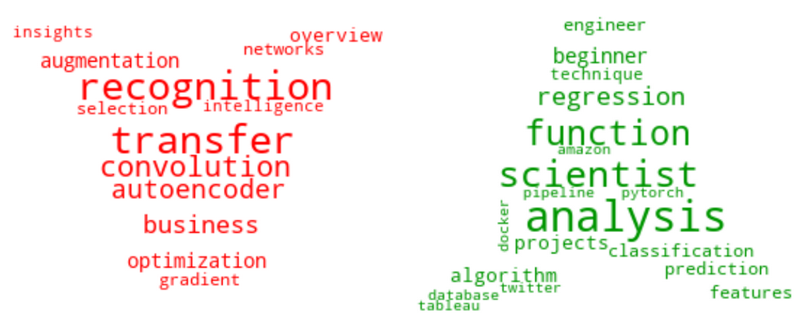

# Medium Article Generator

## Table of Contents

* [General Information](#General-Information)
    * [Exploratory Data Analysis](#Exploratory-Data-Analysis)
    * [GPT-2](#GPT2)
    * [Final Results](#Final-Results)
    * [Tools Used](#Tools-Used)
    * [Future Improvements](#Future-Improvements)

## General Information
Towards Data Science Inc. provides a platform for thousands of people to exchange ideas and to expand their understanding of data science. This projects aims combine use supervised and transfer learning to create a model that is able to detect popular data science article subjects and create an article based on that title. This model will allow someone that sees a Data Science topic in either a news article or web page, to quickly assess if it would be popular on 'Towards Data Science' and then generate the rough draft of an article. Businesses could use models like this to speed up production of articles or news stories.
_______________________________________________
## Exploratory Data Analysis:

Approximately 35,000 article titles, dates, and 'claps' (similar to 'likes') were scraped from 'www.towardsdatascience.com' from 01Jan2018-30Dec2020. The total articles printed increased from around 5000 in 2018 to around 20000 in 2020, which is approximately 50 articles a week! Term Frequency-Inverse Document Frequency (TF-IDF) was used to find words that increased and decreased the most from 2018-2020. Finally, article titles were labelled as popular if they were in the top 35% of 'claps' for that year in order to find the most popular articles to feed into the GPT-2 model. The word clouds below show terms that increased (in green) and decreased (in red) between 2018 and 2020:

  

### The project files are organized as follows:

- EDA.ipynb:
- NLP.ipynb: Project executable code used in AWS SageMaker
- text: Includes the compiled text files used for fine tuning the CPT-2 model
- src: Includes all the functions used in the EDA & NLP files
- data: Includes all the csv files created from the EDA & NLP files

### Articles used for help:

>2

____________________________________________________________

## Supervised Learning Models:

***Step 1: Establish Training and Testing Data***

The training and testing data was compiled from articles between 2018 to 2020 and split into . In order to deal with the disparity in popular articles vs. unpopular articles the decision was made to use...

  

***Step 2: Supervised Model Results***

An initial model used for comparison to the following supervised models: Decision Tree, Random Forest, KNN, XGBClassifier, Gradient Boosting, and Ada Boost Classifier.

  

***Step 3: Transfer Learning Model Results***

Using

  

***Step 4: Other Models***

Using

  

________________________________
## Final Results

The final results from the superviesed models shows that ... model produced the best results in order to predict the popularity of an article based on its title.

 Confusion matrices from the base and final model are shown below for comparison.

  

Results from the transfer learning model shows...
_______________________________________
## Tools Used

***Database:***

Data Storage: CSV Files

***Python:***

Data Gathering: Pandas 
Data Analysis: Google Colab, Tensor Flow, Keras, Pandas, Scikit-Learn 

***Visualization:***

Data Visualization: Matplotlib

_______________________________________
## Future Improvements

1. I
